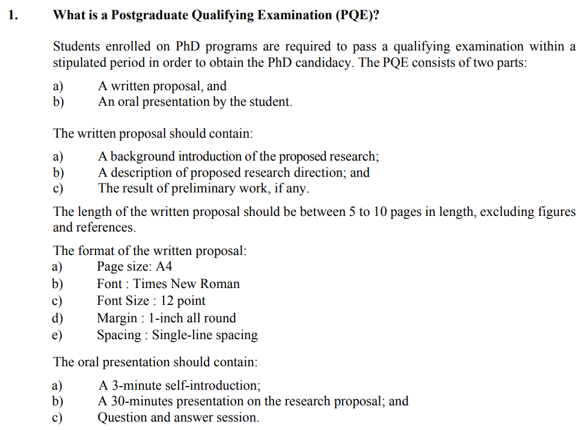

## HKUST Ph.D. Qualification Exam (PQE) template for Ph.D., especially for ECE 2022 and later

There is no official template for a PQE report in Dept. ECE. Below, there are some highlights of the [official guideline of ECE PQE in 2022](https://course.ece.ust.hk/pginfo/PG_Info_PDF/Guidelines_PhD_PQE_new.pdf), which you may take as a reference if you are preparing for the PQE. The PQE commences normally at the beginning of each semester. There will be approximately one month for PQE report writing and oral presentation preparation, respectively.

Therefore, I modified the template from [Lei TAI's template of the thesis](https://github.com/onlytailei/HKUST_latex_thesis_2019). 

